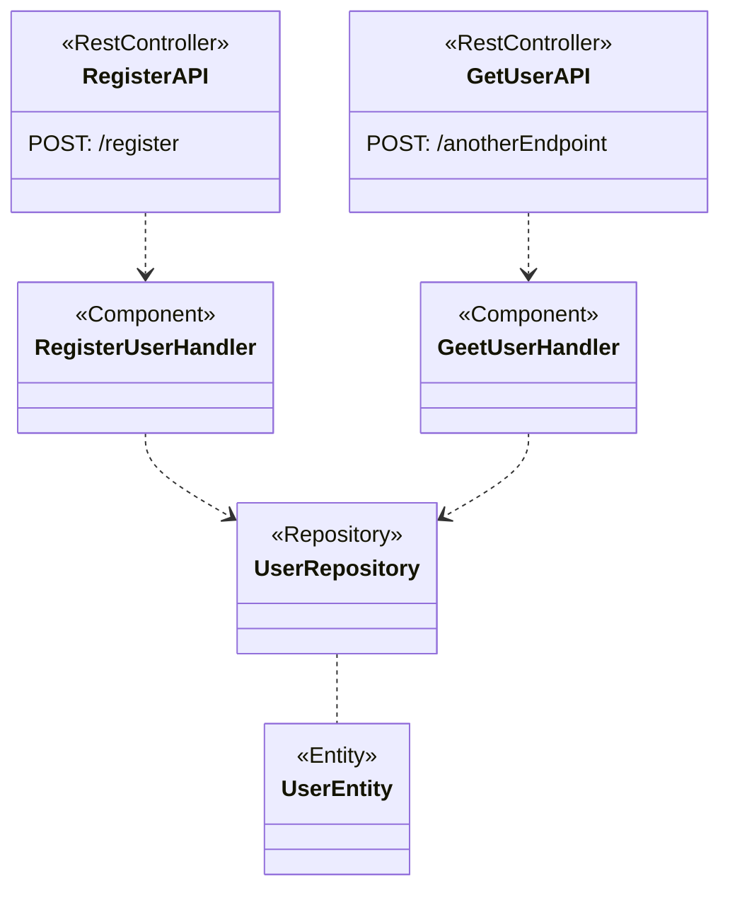

# Spring Boot with Kotlin: Best Practices and Integration Tips

Considerations to achieve the best of two technologies

---

## Intro

Spring Boot stands as one of the most substantial frameworks for web development, involving multiples technologies, including microservices.  
On the other hand, Kotlin emerges as a modern language that not only embraces novel features but also significantly diminishes verbosity. It's wildly adopted in other technologies like mobile, and an increasing integration into various other domains.  
The combination of these two technologies presents a great opportunity for developers and projects alike, offering a good alternative to developer and organizations.

---

> Here, we aim to present the key points for successfully implementing a service applying good practices and keep the simplicity of both technologies.

---

## Tools

- [Kotlin](https://kotlinlang.org/) (1.9.0), JVM 17
- [Spring Boot](https://spring.io/projects/spring-boot) (3.1.3)
- [Gradle](https://gradle.org/) (8.1.1)
- [Intellij Community Edition](https://www.jetbrains.com/idea/) (2023.2.1)

---

## Kotlin

- Created by JetBrains
- Created with the purpose of be concise and legible.
- Multiplatform
- Integration with Java

---

## Let's highlight some important features that we are going to refer later.

---

### Classes are not final by default

```kotlin
class Animal
class Dog : Animal() // It doesn't compile
```

```kotlin
open class Animal // It needs to have the clause
class Cat : Animal()
```

---

### Immutability

```kotlin
val age = 34
age += 1 //It doesn't compile
```

```kotlin
var age = 34 // It needs to be modifiable
age += 1
```

---

### Data Classes

```kotlin
data class Person(
    val name: String,
    val lastname: String
)
```

- It can be immutable.
- It provided implementation to compare(equals).
- To optimize performance in some structures(hashcode).
- It generates a String representation of the data(toString) by default.
- Easy way to copy instances.

---

### Null-safety

```kotlin
val age: Int = null // It doesn't compile
```

```kotlin
class Person {
    val age: Int = 0 // It's required to set an initial value
    lateinit var name: String // Or set the value later

}
```
---
Alternatively, you can define a variable as nullable or non-nullable to keep data secure. This will help avoid Null Pointer Exceptions because it's validated at compilation time. By default, all variables are non-null. If you want to make a class nullable, just add the wildcard ?.

---

### Extensions

```kotlin
fun String.containsNumbers(): Boolean = this.contains("[0-9]")
```

```kotlin
val value = "Hello"
value.containsNumbers()
```

- Use it when you want to add a behaviour to a dependency class
- Use it when you want to organize your code.

---

## Spring Boot

- Supported by VMware Tanzu.
- Based on components using Dependency Injection.
- Promote convention over configuration.
- Provide production-ready features such as metrics, health checks, and externalized configuration.
- Support integration with a lot of technologies.
- Easy to integrate with other libraries.

---



---

### Dependency Injection

- Spring uses DI to handle components.
- It controls interaction among components.
- Initialize components using reflection.

---

### Spring Data

- By default SB uses Hibernate as ORM
- It uses reflection to create instance of entities.
  - Invoking default constructor and extending Entities classes.

---

> How to leverage Kotlin's features in Spring Boot without falling into the verbosity that the language naturally aims to eliminate?

---

### Spring Boot Creation

- [Create a base project](https://start.spring.io/#!type=gradle-project-kotlin&language=kotlin&platformVersion=3.1.3&packaging=jar&jvmVersion=17&groupId=com.example&artifactId=demo&name=demo&description=Demo%20project%20for%20Spring%20Boot&packageName=com.example.demo)

---

### Spring Boot Configuration: build.gradle.kts

```kotlin
plugins {
    id("org.springframework.boot") version "3.1.1"
    id("io.spring.dependency-management") version "1.1.0"
    kotlin("jvm") version "1.9.0"
    kotlin("plugin.spring") version "1.9.0"
    kotlin("plugin.jpa") version "1.9.0"
}
```

---

#### plugin.spring

- It enables extensions for @Configuration and @Service, removing the `final` clause that Kotlin introduces by default.
- [Check documentation here!](https://kotlinlang.org/docs/all-open-plugin.html#spring-support)

---

#### plugin.jpa

- It enables extensions for @Entity, @Embeddable, and @MappedSuperclass, removing the `final` clause that Kotlin introduces by default.
- [Check documentation here!](https://kotlinlang.org/docs/no-arg-plugin.html#jpa-support)

---

#### Enable lazy loading

```kotlin
plugins {
  //...
  kotlin("plugin.allopen") version "1.9.0"
}
allOpen {
    annotation("jakarta.persistence.Entity")
    annotation("jakarta.persistence.Embeddable")
    annotation("jakarta.persistence.MappedSuperclass")
}
```

To enable lazy loading to work as expected, it is required to implement the 'all open' plugin. This might seem a bit unusual because the 'plugin.jpa' is essentially a wrapper for enabling these three annotations precisely.

---

#### JSR 305 support

- To support annotation of null safe annotation from Java and Spring, it's necessary to include the following param
- [Check documentation here!](https://kotlinlang.org/docs/java-interop.html#jsr-305-support)

```kotlin
tasks.withType<KotlinCompile> {
    kotlinOptions {
        freeCompilerArgs += "-Xjsr305=strict"
    }
}
```

---

#### Extra dependencies

```kotlin
dependencies {
    // ...
    implementation("com.fasterxml.jackson.module:jackson-module-kotlin")
    implementation("org.jetbrains.kotlin:kotlin-reflect")
    // ...

}
```

- kotlin-reflect: Used to work reflection with kotlin
- jackson-module-kotlin: to serialize/deserialize JSON

---

### App Overview

- This is a simple application that will contain a component that will support two operations:
  - Register User: Post operation to register a user using name, email and password.
  - Get all user registered: Get to retrieve all registered users.

---

> Go to the code

---

#### Basic Configuration

For informative purposes, these are the settings we will be using for our service.

```yaml
spring:
  datasource.url: jdbc:h2:mem:testing
  jpa:
    show-sql: true
    properties.hibernate.format_sql: true
  h2.console:
    enabled: true
    path: /h2
```

---

#### Use Data classes

- Data classes are helpful when you need to handle read-only information; their default implementation makes them perfect to be used in multiple APIs of the language, such as lists and streams.


```kotlin
data class UserRegisterRequest(
    val email: String,
    val name: String,
    val password: String,
    val nickname: String?
)
```

---

#### Using Abstract classes

```kotlin

@GenericGenerator(
    name = "UUID",
    strategy = "org.hibernate.id.UUIDGenerator"
)
abstract class AbstractEntity {

    open val id: UUID?
        get() {
            return null
        }

    override fun equals(other: Any?): Boolean {
        if (this === other) return true
        if (javaClass != other?.javaClass) return false
        other as AbstractEntity
        return id == other.id
    }

    override fun hashCode(): Int {
        return id.hashCode()
    }
}
```

---

- According to experts like[Vlad Mihalcea](https://vladmihalcea.com/how-to-implement-equals-and-hashcode-using-the-jpa-entity-identifier/) and [Thorben Jansen](https://thorben-janssen.com/ultimate-guide-to-implementing-equals-and-hashcode-with-hibernate/), it is recommended to implement equals and hashCode based on the ID.
- The usage of the default methods generated by a data class could lead to some inconveniences when working with the ORM.
- Another important point recommended is to manage the ID generator with Hibernate. Otherwise, if it is set, Hibernate will check if the record exists in the database, even if it is a new record.

---

#### Using nullability

```kotlin
@Entity
class UserEntity(
    var name: String,
    var email: String,
    var password: String,
    var nickname: String? = null,
) : AbstractEntity() {
    @Id
    @GeneratedValue(generator = "UUID")
    override lateinit var id: UUID

    @OneToOne(fetch = FetchType.LAZY, cascade = [CascadeType.ALL])
    var configuration: UserConfigurationEntity? = null
}
```

---

##### Note some important stuffs

- Usage of default values.
- Usage of nullability (?) to identify optional fields.
- The override implementation is made explicitly to avoid confusion about the origin of the value.
- Lack of non-args constructor: Empty constructors are not required since this feature is covered by the plugin described previously.

---

#### Use extensions to enhance readability

```kotlin
@RestController
class GetUserController(
    private val handler: GetUserHandler
) {
    @GetMapping("/user/{email}")
    fun getByEmail(@PathVariable email: String): UserResponse? =
        handler.handler(email).toResponseOrThrow()
}
//...

fun UserEntity?.toResponseOrThrow(): UserResponse = this?.let {
    UserResponse(
        name = it.name,
        email = it.email,
        nickname = it.nickname
    )
} ?: throw ErrorCode.USER_NOT_FOUND.toException()

```
---

Use extensions to group some behavior into a unit of work. In this example, we are combining the extension feature with wildcards for nulls. It doesn't matter what the handler function returns; the extension is already handling null responses, throwing a customized exception.

---

#### Use named arguments and default values

```kotlin

data class UserResponse(
    val name: String,
    val email: String,
    val nickname: String? = null
)

fun UserEntity?.toResponseOrThrow(): UserResponse = this?.let {
    UserResponse(
        name = it.name,
        nickname = it.nickname,
        email = it.email
    )
} ?: throw ErrorCode.USER_NOT_FOUND.toException()

```

---

Named arguments help you make code more readable. They also allow you to place arguments in an order that depends on the context.

---

#### Use scope functions

Instead of this

```kotlin
    @ExceptionHandler(BusinessException::class)
fun handleBusinessException(ex: BusinessException): ResponseEntity<ErrorResponse> {
    val errorResponse = ErrorResponse(ex.message, ex.errorCode.code)
    val result = ResponseEntity.status(HttpStatus.BAD_REQUEST).body(errorResponse)
    logger.error(ex.message)
    return result
}
```

Use this

```kotlin
    fun handleBusinessException(ex: BusinessException): ResponseEntity<ErrorResponse> =
    ErrorResponse(ex.message, ex.errorCode.code)
        .let { ResponseEntity.status(HttpStatus.BAD_REQUEST).body(it) }
        .also { logger.error(ex.message) }
```
---

Scope functions are useful when you want to narrow the scope of a value within a limited block of code. In this case, the first block of code creates some one-time-use variables. The other block does the exact same thing but uses a scope function, reducing the number of declared variables and generating readable code.


---

#### Use sealed interfaces for function responses

This

```kotlin
   sealed interface Result {
    data class Success(val user: UserEntity) : Result
    data object EmailAlreadyRegistered : Result
    data object InvalidName : Result
}
```

---

Can be used as

```kotlin

@PostMapping("/register")
fun register(@RequestBody user: UserRegisterRequest): UserResponse =
    when (val result = handler.handle(
        RegisterUserHandler.Command(
            name = user.name,
            email = user.email,
            password = user.password
        )
    )) {
        is RegisterUserHandler.Result.Success -> result.user.toResponseOrThrow()

        is RegisterUserHandler.Result.EmailAlreadyRegistered -> throw ErrorCode.USER_ALREADY_EXISTS.toException()

        is RegisterUserHandler.Result.InvalidName -> throw ErrorCode.INVALID_NAME.toException()
    }
```
---

Scope functions are useful when you want to narrow the scope of a value within a limited block of code. In this case, the first block of code creates some one-time-use variables. The other block does the exact same thing but uses a scope function, reducing the number of declared variables and generating readable code.

---

#### It makes Optional optional

- Optional doesn't make sense anymore with null-safety code

```kotlin
@Repository
interface UserRepository : JpaRepository<UserEntity, UUID> {

    fun countByEmail(email: String): Long

    fun findByEmail(email: String): UserEntity?
}

```

---

## Conclusions

- Kotlin is an excellent alternative for working with Spring Boot.
- The transition from Java to Kotlin can be relatively straightforward, but fully leveraging all of its features may take some time to become accustomed to.
- There are a few minor details that may be challenging to grasp, but the benefits make it worthwhile.

---

## References

- Spring Guides. "Understanding Generated App." GitHub. https://github.com/spring-guides/tut-spring-boot-kotlin#understanding-generated-app, 2023
- Vlad Mihalcea. "How to Implement equals and hashCode using the JPA Entity Identifier." https://vladmihalcea.com/how-to-implement-equals-and-hashcode-using-the-jpa-entity-identifier/, 2023
- Thorben Janssen. "Ultimate Guide to Implementing equals and hashCode with Hibernate." https://thorben-janssen.com/ultimate-guide-to-implementing-equals-and-hashcode-with-hibernate/, 2023
- Leonardo Camacho "Kotlin Best Practices for Java Developers". Gorilla Logic. https://gorillalogic.com/blog/kotlin-best-practices-for-java-developers
