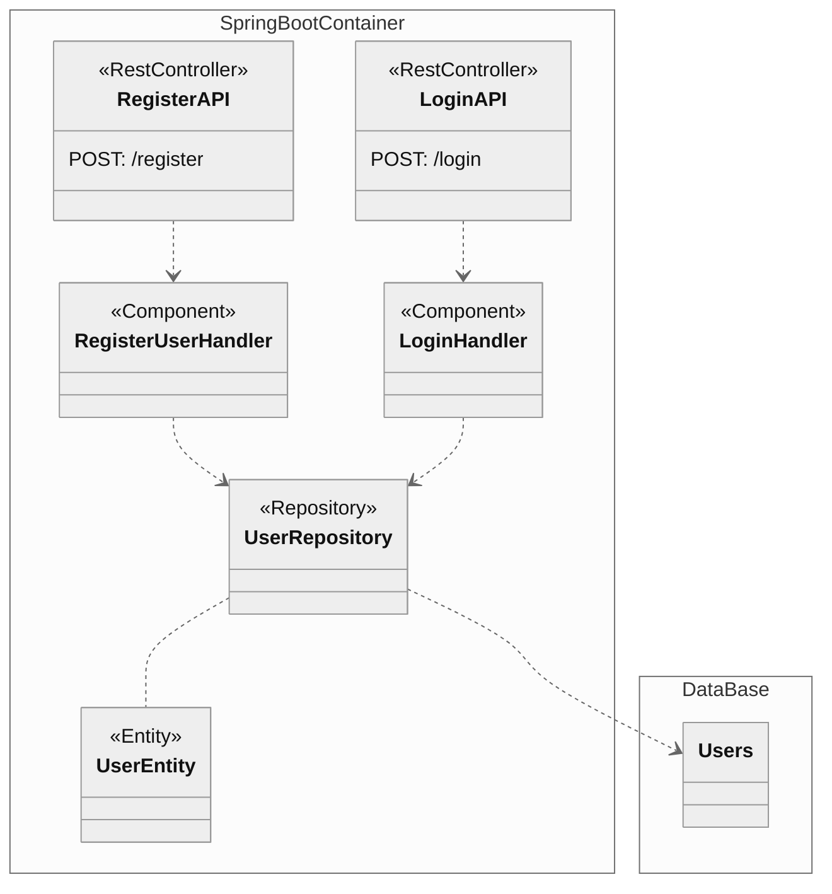

# Kotlin and Spring Boot

Considerations to achieve the best of two technologies

---

## Intro

Spring Boot stands as one of the most substantial frameworks for web development, involving multiples technologies,
including microservices. On the other hand, Kotlin emerges as a modern language that not only embraces novel features
but also significantly diminishes verbosity. It's wildly adopted in other technologies like mobile, and an increasing
integration into various other domains. The combination of these two technologies presents a great opportunity for
developers and projects alike, offering a good alternative to developer and organizations.

---

Here, we aim to present the key points for successfully implementing a service applying good practices and keep the
simplicity of both technologies.

---

## Tools

- [Kotlin](https://kotlinlang.org/) (1.9.0), JVM 17
- [Spring Boot](https://spring.io/projects/spring-boot) (3.1.3)
- [Gradle](https://gradle.org/) (8.1.1)
- [Intellij Community Edition](https://www.jetbrains.com/idea/) (2023.2.1)

---

## Kotlin

- Created by JetBrains
- Created with the purpose of be concise and legible.
- Multiplatform

  Let's highlight some important features that we are going to refer later.

---

### Classes are not final by default

```kotlin
class Animal
class Dog : Animal() // It doesn't compile
```

```kotlin
open class Animal // It needs to have the clause
class Cat : Animal() 
```

---

### Immutability

```kotlin
val age = 34
age += 1 //It doesn't compile
```

```kotlin
var age = 34 // It needs to be modifiable
age += 1 
```

---

### Data Classes

```kotlin
data class Person(
    val name: String,
    val lastname: String
)
```

- It can be immutable.
- It provided implementation to compare(equals).
- To optimize performance in some structures(hashcode).
- It generates a String representation of the data(toString) by default.
- Easy way to copy instances.

---

### Null-safety

```kotlin
val age: Int = null // It doesn't compile
```

```kotlin
class Person {
    val age: Int = 0 // It's required to set an initial value
    lateinit var name: String // Or set the value later

}
```

---

### Extensions

```kotlin
fun String.containsNumbers(): Boolean = this.contains("[0-9]")
val value = "Hello"
value.containsNumbers()
```

- Use it when you want to add a behaviour to a dependency class
- Use it when you want to organize your code.

---

## Spring Boot

- Supported by VMware Tanzu.
- Based on components using Dependency Injection.
- Promote convention over configuration.
- Provide production-ready features such as metrics, health checks, and externalized configuration.
- Support integration with a lot of technologies.
- Easy to integrate with other libraries.

---



---

### Dependency Injection

- Spring uses DI to handle components.
- It controls interaction among components.
- Initialize components using reflection.

---

### Spring Data

- By default SB uses Hibernate as ORM
- It uses reflection to create instance of entities.
    - Invoking default constructor and extending Entities classes.

---
> How to leverage Kotlin's features in Spring Boot without falling into the verbosity that the language naturally aims to eliminate?
---

### Spring Boot Creation

- [Create a base project](https://start.spring.io/#!type=gradle-project-kotlin&language=kotlin&platformVersion=3.1.3&packaging=jar&jvmVersion=17&groupId=com.example&artifactId=demo&name=demo&description=Demo%20project%20for%20Spring%20Boot&packageName=com.example.demo)

---

### Spring Boot Configuration: build.gradle.kts

```kotlin
plugins {
    id("org.springframework.boot") version "3.1.1"
    id("io.spring.dependency-management") version "1.1.0"
    kotlin("jvm") version "1.8.22"
    kotlin("plugin.spring") version "1.8.22"
    kotlin("plugin.jpa") version "1.8.22"
}
```

#### plugin.spring

- It enables extensions for @Configuration and @Service, removing the `final` clause that Kotlin introduces by default.
- [Check documentation here!](https://kotlinlang.org/docs/all-open-plugin.html#spring-support)

---
#### plugin.jpa
- It enables extensions for @Entity, @Embeddable, and @MappedSuperclass, removing the `final` clause that Kotlin introduces by default.
- [Check documentation here!](https://kotlinlang.org/docs/no-arg-plugin.html#jpa-support)

---

#### Basic Configuration

````yaml
spring:
  datasource.url: jdbc:h2:mem:testing
  jpa:
    show-sql: true
    properties.hibernate.format_sql: true
  h2.console:
    enabled: true
    path: /h2
````

- [x] Create a Basic Rest
- [x] Using Data Classes to define API Types
    - [x] Declare Controllers
- [x]  Using Classes for JPA Definition
    - [x]  Declare classes and extend Abstract
- [x]  Use null
- [ ] safety to protect data
    - [ ]  Declare explicit nullable fields(Using wildcard `?`)
- [ ]  Use immutability to declare fields
    - [ ]  Use of `val` and `var`
- [x]  Use extensions for adapters(mappers)
    - [x]  Declaring extension functions
- [x]  Use name params for readability
    - [x]  Show and example how parameter orders can be changed putting explicitly the names of params in a
      function/constructor
- [x]  Use scope functions
- [x]  Use sealed interfaces
- [ ]  Conclusions


